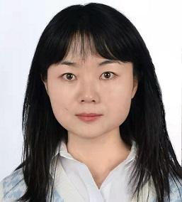

## 

 **∩_∩**Hi,  I am Chengcheng,  currently a [postdoc](https://www.asc.tuwien.ac.at/?id=contact&name=gerencser) in the group of [Ass. Prof.  M\'at\'e Gerensc\'er](https://www.asc.tuwien.ac.at/gerencser/) at [TU Wien](https://www.asc.tuwien.ac.at/?id=analysis/people). I was a Phd student in the [IRTG 2235](https://irtg.math.uni-bielefeld.de/user/ling/start) at [Bielefeld University](https://www.uni-bielefeld.de/(en)/fakultaeten/mathematik/) supervised by [Prof.  R"ockner](https://ekvv.uni-bielefeld.de/pers_publ/publ/PersonDetail.jsp?personId=10585), later a Postdoc in [Research Unit FOR 2402](https://sites.google.com/site/researchunitfor2402/) under the supervision of [Prof. Scheutzow](https://page.math.tu-berlin.de/~scheutzow/) and [Dr. habil. Sebastian Riedel](https://www.analysis.uni-hannover.de/en/institute/people/sebastian-riedel/).

### Research Interests

Stochatic analysis and its ralated, particularly, SDEs with singular drifts, random dynamical systems, PDEs, machine learning (for fun)

### Publications

1. [Stochastic Differential Equations with Singular Drifts and Multiplicative Noises](https://pub.uni-bielefeld.de/record/2941478) (**PhD thesis 2019**), C.~Ling. 
2. [Strong well-posedness for stochastic differential equations with coefficients in mixed-norm spaces](https://link.springer.com/article/10.1007/s11118-021-09913-4) (**Potential Analysis**), C.~Ling, L. Xie 
3. [Regularity of Local times associated to Volterra-L\'evy processes and  path-wise regularization of stochastic differential equations](https://www.duo.uio.no/bitstream/handle/10852/88145/Harang-Ling2021_Article_RegularityOfLocalTimesAssociat.pdf?sequence=1) (**Journal of Theoretical Probability**), F.A. Harang, C. ~Ling.  
4. [Nonlocal elliptic equation in H\"older space and the martingale problem](https://www.sciencedirect.com/science/article/abs/pii/S0022039622000316) (**Journal of Differential Equations**), C.~Ling, G. Zhao 
5. [The perfection of local semi-flows and local random dynamical systems with applications to SDEs](https://www.worldscientific.com/doi/abs/10.1142/S021949372240010X?journalCode=sd) (**Stochastics and Dynamics**), C.~Ling, M. Scheutzow, I. Vorkastner. 
6. [A Wong-Zakai theorem for SDEs with singular drift](https://www.sciencedirect.com/science/article/pii/S0022039622002674?dgcid=coauthor) (**Journal of Differential Equations**), C.~Ling, S. Riedel, M. Scheutzow. 
7. [Stability estimates for singular SDEs and applications](https://arxiv.org/pdf/2208.03670.pdf) (**Electronic Journal of Probability**) L. Galeati, C.~Ling.

### Preprints

1. [SDEs with singular drifts and multiplicative noise on general space-time domains](https://arxiv.org/pdf/1910.03989.pdf.)  C.~Ling, M. R\"ockner, X. Zhu.
2. [Taming singular stochastic differential equations: A numerical method](https://arxiv.org/pdf/2110.01343.pdf) K. L^e, C.~Ling.
3. [Expansion and attraction of RDS:  long time behavior of the solution to singular SDE](https://arxiv.org/pdf/2211.14202.pdf)  C.~Ling, M. Scheutzow.
4. [Path-by-path uniqueness for stochastic differential equations under Krylov-Röckner condition](https://arxiv.org/pdf/2304.06802.pdf)  L. Anzeletti, K. Lê, C.~Ling.

###  CV
Here is my [CV](cv_CCL.pdf).

###  Contact

Email: chengcheng.ling@asc.tuwien.ac.at 

Address: Wiedner Hauptstraße 8, 1040 Wien,  DA 06 F22

